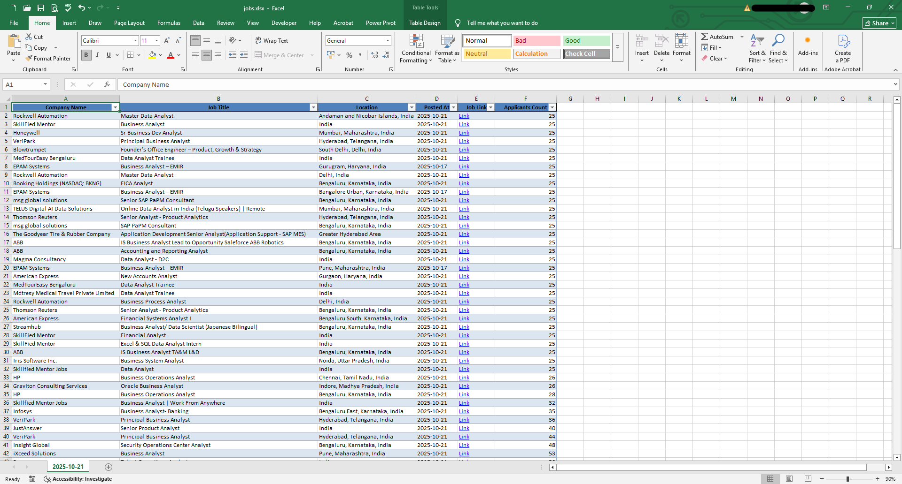

# LinkedIn Job Scraper

An automated tool that scrapes LinkedIn job listings using Apify's LinkedIn Jobs Scraper actor and exports the results to Excel.

## Features

- Scrapes job listings from multiple LinkedIn search URLs
- Configurable time ranges (1 hour, 3 hours, 24 hours, 1 week)
- Exports results to Excel spreadsheet
- Timestamps each scraping session
- Supports environment variables for configuration

## Prerequisites

- Python 3.6+
- Apify API Token
- Required Python packages (see requirements.txt)

## Installation

1. Clone the repository
```sh
git clone https://github.com/yourusername/job-scraper.git
cd job-scraper
```

2. Install dependencies
```sh
pip install -r requirements.txt
```

3. Create a `.env` file in the project root with your configuration:
```sh
APIFY_API_TOKEN=your_apify_token_here
EXCEL_FILE_NAME=jobs.xlsx
```

## Usage

Run the script:
```sh
python main.py
```

The script will:
1. Fetch job listings from LinkedIn using specified search URLs
2. Process the data using Apify's LinkedIn Jobs Scraper
3. Save the results to an Excel file
4. Display the progress in the console

## Configuration

You can modify the search URLs and parameters in `main.py`:
- Time ranges (1hr, 3hr, 24hrs, 1week)
- Geographic location (via geoId)
- Keywords
- Number of results to fetch

## Output

The script generates an Excel file containing job listings with details like:
- Company Name
- Job Title
- Location
- Posted Date
- Job Link
- Applicant Count



## Author
kanavchopra2002@gmail.com

## Support
If you found this project helpful, consider starring the repository!

## License

MIT
